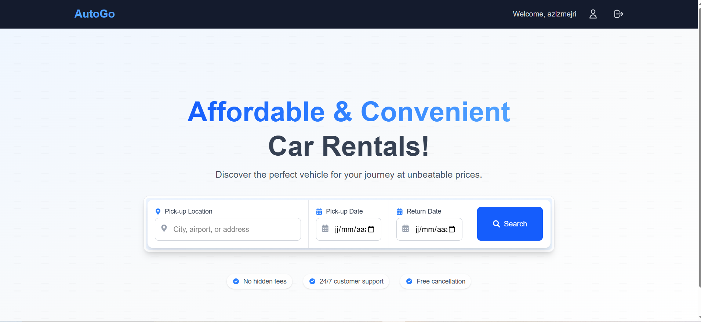
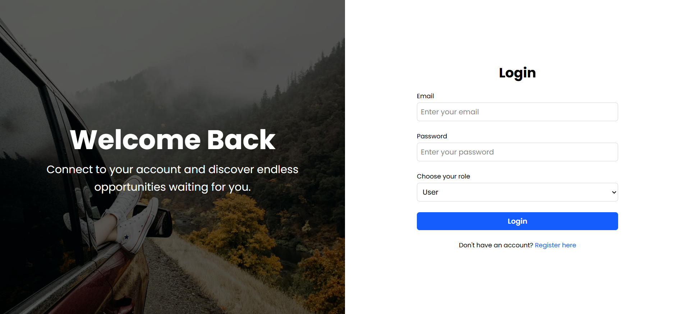
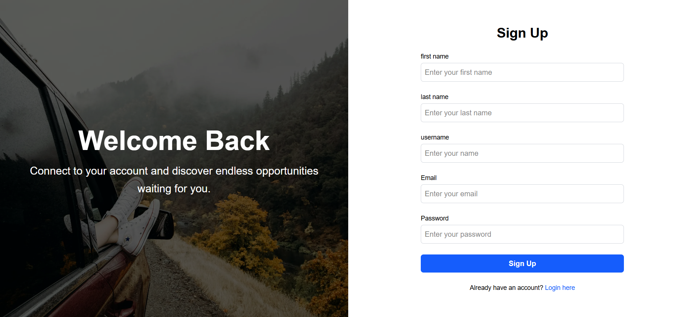
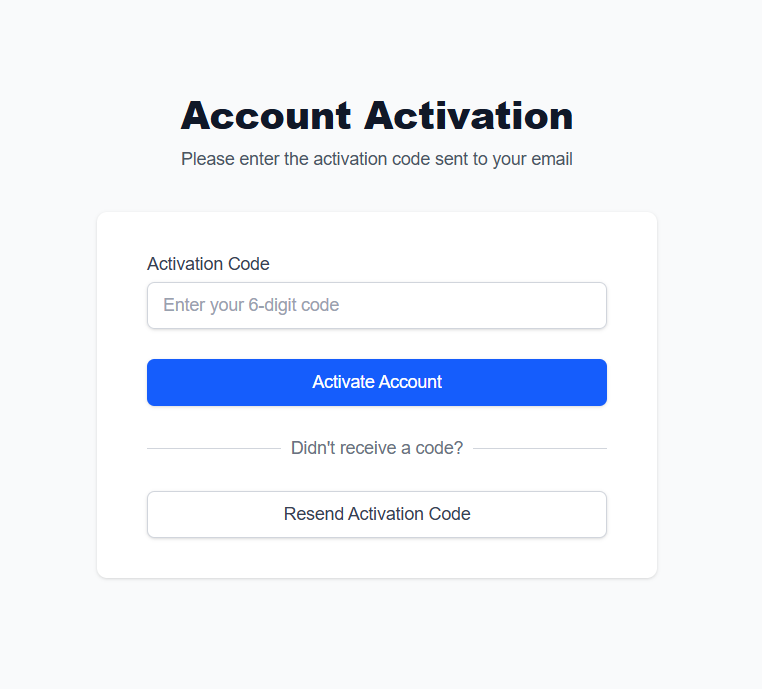
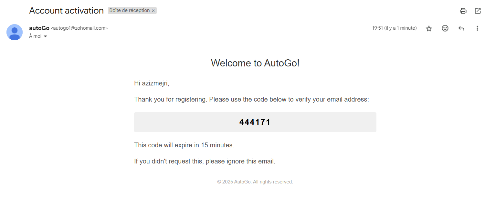
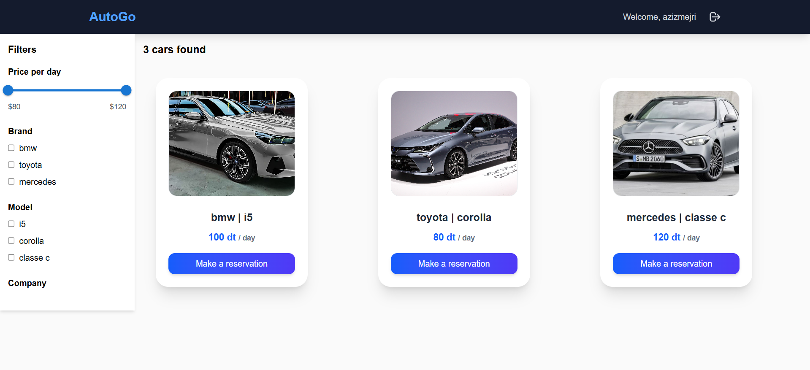
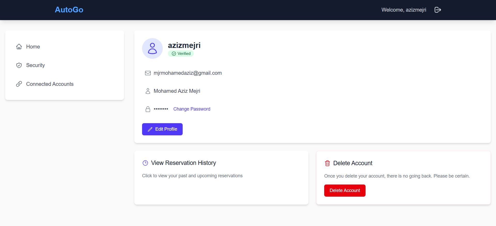
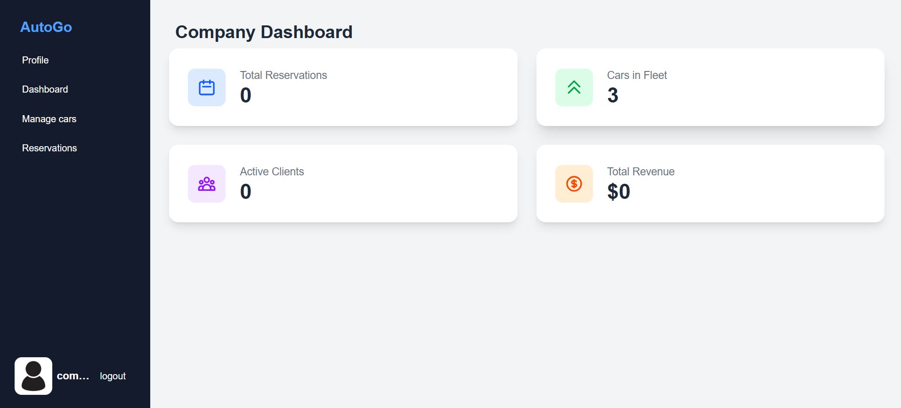
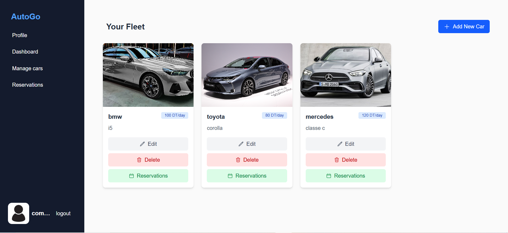

# 🚗 Car Rental Platform

A full-stack car rental platform that allows users to browse, filter, and book cars, and provides an admin interface for managing cars and monitoring platform analytics.

---

## 📸 Screenshots

<h3>🏠 Home Page</h3>

<h3>🔐 Login & Signup</h3>

<h3>📧 Email Verification</h3>

<h3>🚘 Search Results</h3>

<h3>👤 User Profile</h3>

<h3>🛠️ Admin Dashboard</h3>

<h3>🚗 Car Management Interface</h3>

---

## 🚀 Key Features

- 🔐 **Secure Authentication**
  - JWT-based login & registration
  - Email verification for secure user onboarding

- 📅 **Booking System**
  - Car availability checks
  - Date filtering
  - Reservation confirmation flow

- 🧑‍💼 **Admin Dashboard**
  - Bookings & Revenue analytics
  - Car inventory management

- 🔎 **Search & Filtering**
  - Filter cars by brand, model, and price range

---

## 🧰 Tech Stack

### Backend
- **NestJS** – Scalable server-side framework
- **TypeORM** – TypeScript ORM for PostgreSQL
- **PostgreSQL** – Relational database
- **JWT** – JSON Web Token authentication

### Frontend
- **React** – Component-based frontend library
- **Tailwind CSS** – Utility-first CSS framework
